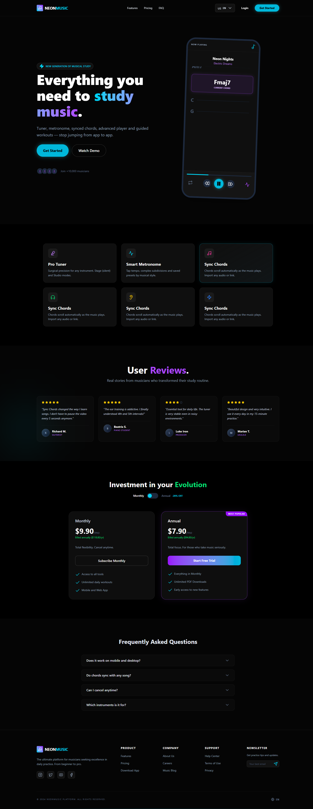
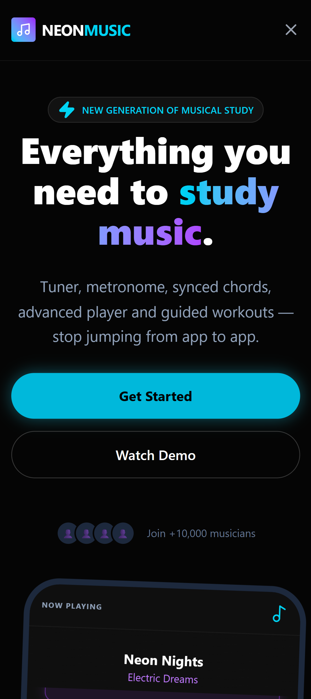
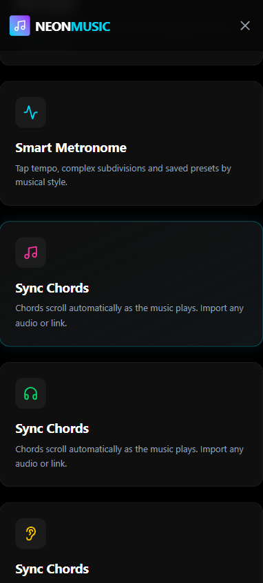
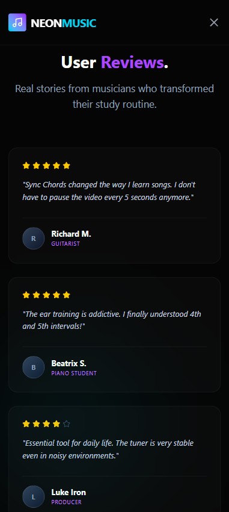
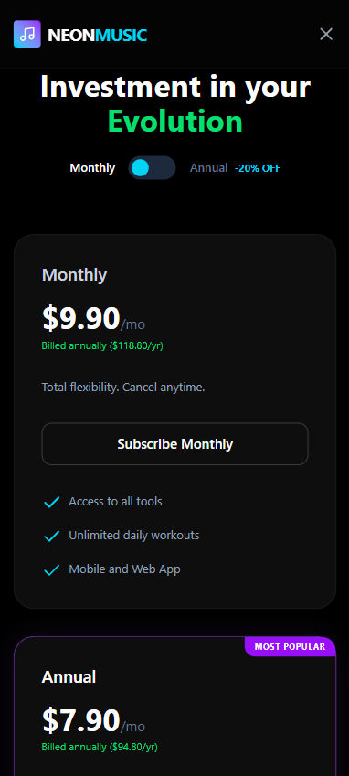

# Introduction
1. Project
2. Tech Stack
    - Core
    - Environment
3. Project Structure
    - Adopted Principles
4. Web Desktop Screenshot
5. Web Mobile Screenshot

---

## 1. Project 💻

This project is a **High-Converting Landing Page** for a fictional application called **NeonStudio**, focused on music study.  
The design follows a **Premium Dark** aesthetic, using neon colors (Cyan and Purple) and the **Glassmorphism** style (translucent glass effect).

### 🔗 [Access the project](https://danielcavalcante99.github.io/frontend-neonstudio/)

---

## 2. 🛠️ Tech Stack

This project uses modern technologies to ensure performance, scalability, and an excellent developer experience.

### 🚀 Core
- ⚡ **Vite** `7.2.4` — Ultra-fast build tool and development server
- ⚛️ **React** `19.2.5` — Library for building user interfaces
- 🔷 **TypeScript** `5.9.3` — Static typing and code safety

### 🧰 Environment
- 🟢 **Node.js** `24.10.1` — JavaScript runtime environment

---

## 3. 📁 Project Structure
~~~ 
src/
├── app/
│   ├── App.tsx
│   └── providers.tsx
│
├── assets/
│   ├── icons/
│   └── screenshots/
│
├── components/
│   ├── ui/
│   │   ├── FeatureCard.tsx
│   │   ├── FaqItem.tsx
│   │   ├── FooterLink.tsx
│   │   └── SocialIcon.tsx
│   │
│   ├── layout/
│   │   ├── Navbar/
│   │   │   ├── Navbar.tsx
│   │   │   └── LanguageDropdown.tsx
│   │   └── Footer/
│   │       └── Footer.tsx
│
├── features/
│   ├── landing/
│   │   ├── page/
│   │   │   ├── LandingPage.tsx
│   │   ├── sections/
│   │   │   ├── HeroSection.tsx
│   │   │   ├── FeaturesSection.tsx
│   │   │   ├── TestimonialsSection.tsx
│   │   │   ├── PricingSection.tsx
│   │   │   └── FaqSection.tsx
│   │   ├── i18n/
│   │   │   ├── translations-landing.types.ts
│   │   │   └── translations-landing.ts
│   │   └── hooks/
│   │       └── useAutoScroll.ts
│
├── i18n/
│   ├── LanguageContext.tsx
│   ├── translation-types.ts
│   ├── translations.ts
│   │
│   └── useLanguage.ts
│
├── styles/
│   └── globals.css
│
├── types/
│   └── language.types.ts
│
├── utils/
│   └── browserLanguage.ts
│
└── main.tsx
~~~

This structure follows a **feature-based** approach, focused on scalability, reuse, and a clear separation of responsibilities.

### **app/**
Application initialization layer.
- Responsible for bootstrapping React
- Centralizes global providers (Context API, theme, i18n, etc.)
- Does not contain business logic or feature-specific UI

---

### **assets/**
Static project assets.
- **icons/** → SVG icons used by components
- **screenshots/** → Preview images (landing, features, dashboard)

---

### **components/**
Reusable and domain-agnostic components.
- **ui/** → Small UI-focused components (cards, items, icons, links)
- **layout/** → Global application structure (Navbar, Footer) that does not know pages or features

---

### **features/**
Pages and business rules isolated by domain.  
Each feature represents a real part of the product.
- **hooks/** → Feature-specific reusable hooks (effects, timers, scroll, interactions)
- **i18n/** → Isolated internationalization, with texts shared only within the feature itself
- **page/** → Feature page component, responsible for composing and orchestrating sections, without business logic or fine-grained layout concerns
- **sections/** → Visual page sections; each section represents an independent UI block containing feature-specific UI, behavior, and content, making maintenance, reordering, and internal reuse easier

---

### **i18n/**
Global application internationalization.
- Manages language, context, and translations shared across features

---

### **styles/**
Global application styles.
- CSS reset, global variables, and base styles

---

### **types/**
Shared types and contracts.
- Type definitions reused across multiple layers of the project

---

### **utils/**
Pure utility functions.
- Reusable helpers with no React dependency

---

### **main.tsx**
Application entry point.
- Creates the React root
- Renders the `App`
- Imports global styles

---

### 🧠 Adopted Principles
- Components do not know business rules
- Features are isolated and independent
- Hooks encapsulate behavior, not UI
- Internationalization is modular and decoupled

✅ **Scalable**

New pages, languages, or features can be added without affecting the rest of the codebase.  
Easy to evolve into a monorepo in the future.

✅ **More readable code**

Each file remains small, and it is always clear where to make changes when something breaks.

---

## 4. Web Desktop Screenshot

---

## 5. Web Mobile Screenshot

|  |  |
|----------------------------------------------|---------------------------------------|
|     |   |
